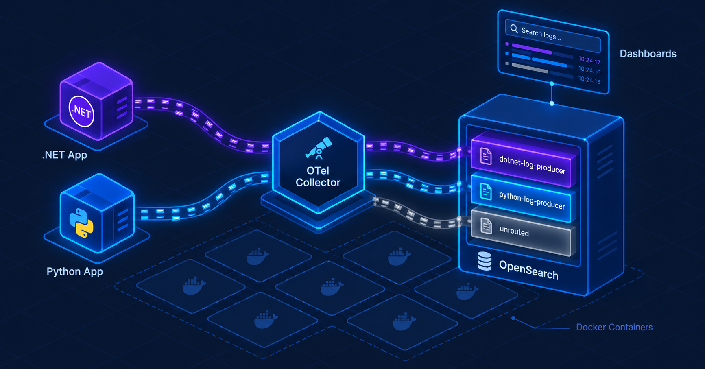

# OTel Collector lab

Two small apps (.NET and Python) send logs to an **OpenTelemetry Collector**.
The Collector stores each app's logs in its own **OpenSearch** index. You browse them in **OpenSearch Dashboards**.



## Run it

You only need Docker.

```
docker compose up -d --build
```

Wait about a minute, then open:

| What | Where |
|---|---|
| Logs (Discover) | http://localhost:5601 |
| Indices | http://localhost:9200/_cat/indices?v |

Each app sends a log every 3 seconds for 2 minutes, then stops.

## Useful commands

| To… | Run |
|---|---|
| Run an app again | `docker compose up -d dotnet-log-producer` (or `python-log-producer`) |
| Apply a change to `otel-collector.yaml` | `docker compose restart otel-collector` |
| Rebuild after changing app code | `docker compose up -d --build` |
| Stop (keep the logs) | `docker compose down` |
| Delete everything and start over | `docker compose down -v` |

## How it works

1. **The apps** send logs to the Collector (port 4317). Each app has a name (`service.name`).
2. **The Collector** ([otel-collector.yaml](otel-collector.yaml)) looks at the name and picks the index:
   - `dotnet-log-producer` → index `dotnet-log-producer`
   - `python-log-producer` → index `python-log-producer`
   - any other name → index `unrouted`

   This is done by the [routing connector](https://github.com/open-telemetry/opentelemetry-collector-contrib/tree/v0.161.0/connector/routingconnector),
   and the logs are written by the [OpenSearch exporter](https://github.com/open-telemetry/opentelemetry-collector-contrib/tree/v0.161.0/exporter/opensearchexporter).
   Both come with the `otel/opentelemetry-collector-contrib:0.161.0` image, and both are marked *alpha* for logs.
3. **The init job** ([opensearch/init.sh](opensearch/init.sh)) runs once at startup, before any log is sent. It creates the indices
   and the Dashboards index patterns.

Startup order: OpenSearch → Dashboards → init job → Collector → apps.

## Add a new app

1. In [otel-collector.yaml](otel-collector.yaml), add a routing rule, a pipeline and an exporter for the new name.
2. In [opensearch/init.sh](opensearch/init.sh), add the index name to `INDICES`.
3. Run `docker compose up opensearch-init` (creates the new index), then `docker compose restart otel-collector`.

## Project files

| Path | What it is |
|---|---|
| `docker-compose.yml` | All containers and their startup order |
| `otel-collector.yaml` | Collector config: receive, route, export |
| `opensearch/init.sh` | Creates indices and index patterns |
| `opensearch/index-template-log-producers.json` | Field types and settings for the indices |
| `LogProducer/` | .NET app |
| `LogProducerPython/` | Python app |
| `docs/` | Architecture image |

## Notes

- For learning only: OpenSearch runs **without security** (no password, no HTTPS).
- If an app's logs land in `unrouted`, its name doesn't match a routing rule.
